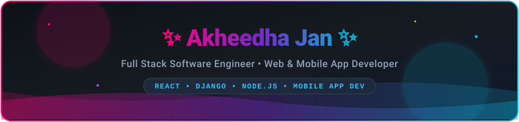

  <!-- Self-Hosted Animated Header Banner with Neon Gradient & Twinkling Effects -->
  

   

  <!-- Animated Professional Titles -->
  

   

  <!-- Social & Connect Badges -->
  

    
    
    
  

## 🌟 Quick Snapshot

<table>
  <tr>
    <td>💼 <strong>Status</strong></td>
    <td></td>
    <td>📍 <strong>Location</strong></td>
    <td></td>
  </tr>
  <tr>
    <td>🎓 <strong>Education</strong></td>
    <td></td>
    <td>📱 <strong>Mobile Dev</strong></td>
    <td></td>
  </tr>
  <tr>
    <td>🤖 <strong>AI Stack</strong></td>
    <td></td>
    <td>⚡ <strong>Core Stack</strong></td>
    <td></td>
  </tr>
</table>

---

## 👩‍💻 About Me

- 🚀 Full Stack & Mobile Developer passionate about building high-performance web apps and modern software solutions.
- 🐍 Specialized in **Python Full Stack** (Django, DRF) and **MERN Stack** (MongoDB, Express, React, Node.js).
- 📱 Developing cross-platform mobile apps with responsive, intuitive user interfaces.
- 🤖 Integrating practical **AI capabilities** into scalable real-world digital products.
- ☁️ Skilled in **Docker, Linux, GitHub Actions CI/CD, and AWS Cloud deployments**.

---

## 🔥 Contribution Activity

  

---

## 🎯 Core Engineering Strengths

<table>
  <tr>
    <td width="50%" valign="top">
      <h3 align="center">🎨 Frontend & Mobile Architecture</h3>
      

        
        
        
      

      <ul>
        <li>Responsive, component-driven Single Page Applications (SPAs) & mobile interfaces.</li>
        <li>Dynamic data visualization using <strong>Recharts</strong> and clean state management.</li>
        <li>Modern design systems with Tailwind CSS & Bootstrap.</li>
      </ul>
    </td>
    <td width="50%" valign="top">
      <h3 align="center">⚙️ Backend & API Design</h3>
      

        
        
        
      

      <ul>
        <li>Robust RESTful APIs with <strong>Django REST Framework</strong> and Express.js.</li>
        <li>Secure authentication flows via <strong>JWT</strong> & Role-Based Access Control.</li>
        <li>Optimized relational schemas across PostgreSQL, MySQL & SQLite.</li>
      </ul>
    </td>
  </tr>
  <tr>
    <td width="50%" valign="top">
      <h3 align="center">🤖 AI & Intelligent Products</h3>
      

        
        
      

      <ul>
        <li>Automated expense breakdown & predictive budgeting using <strong>Gemini API</strong>.</li>
        <li>ATS resume analysis, skill-gap detection, and contextual advice extraction.</li>
        <li>⚡ <strong>80–85% reduction in manual processing time</strong>.</li>
      </ul>
    </td>
    <td width="50%" valign="top">
      <h3 align="center">🚀 Cloud & DevOps</h3>
      

        
        
        
      

      <ul>
        <li>Containerizing full-stack multi-service apps with <strong>Docker</strong>.</li>
        <li>Automated testing, building, and deployments with <strong>GitHub Actions</strong>.</li>
        <li>Cloud hosting and storage on <strong>AWS EC2, S3, Vercel, and Render</strong>.</li>
      </ul>
    </td>
  </tr>
</table>

---

## 🛠️ Tech Stack & Tooling

### 💻 Languages

  
  
  
  
  
  

### 🎨 Frontend Frameworks & Libraries

  
  
  
  

### ⚙️ Backend & API Development

  
  
  
  
  

### 🗄️ Databases & Storage

  
  
  
  

### ☁️ Cloud, DevOps & Tools

  
  
  
  
  
  
  
  

---

## 🚀 Featured Projects

<table>
  <!-- Project 1 -->
  <tr>
    <td width="50%" valign="top">
      <h3 align="center">🏗️ BuildMetrics</h3>
      
<strong>AI-Powered Construction Project & Expense Management Platform</strong>

      

        
        
        
        
      

      <ul>
        <li>Integrated <strong>Google Gemini API</strong> for automated expense categorization & cost estimation.</li>
        <li>Full-stack workflow managing 20+ expense records across 5 real construction projects.</li>
        <li>⚡ <strong>Reduced manual expense logging time by 85%</strong>.</li>
        <li>Interactive financial charts powered by <strong>Recharts</strong>.</li>
      </ul>
      

        
        
      

    </td>
    <!-- Project 2 -->
    <td width="50%" valign="top">
      <h3 align="center">📄 ResumeForge</h3>
      
<strong>AI-Powered Resume & ATS Evaluation Platform</strong>

      

        
        
        
        
      

      <ul>
        <li>Automated ATS compatibility scoring, skill-gap detection, and tailored improvement advice.</li>
        <li>Integrated <strong>OpenRouter API</strong> & PDF parsing pipeline to extract candidate data.</li>
        <li>⚡ <strong>Reduced manual resume review effort by ~80%</strong>.</li>
        <li>Clean, responsive interface with real-time score feedback.</li>
      </ul>
      

        
        
      

    </td>
  </tr>
  <!-- Project 3 -->
  <tr>
    <td colspan="2" valign="top">
      <h3 align="center">🎬 LumixPlay</h3>
      
<strong>Full Stack OTT Streaming & Media Discovery Platform</strong>

      

        
        
        
        
        
        
      

      <ul>
        <li>Secure user authentication (JWT), dynamic movie catalog, custom watchlists, and trailer playback.</li>
        <li>Django REST backend supporting 15+ titles, category filtering, and administrative curation dashboard.</li>
        <li>Deployed responsive frontend on <strong>Vercel</strong> with backend hosted on <strong>Railway</strong>.</li>
      </ul>
      

        
        
      

    </td>
  </tr>
</table>

---

## 📬 Let's Connect!

  I'm always open to discussing new opportunities, full-stack & mobile development roles, open-source projects, and AI product ideas.

  
  
  

  

