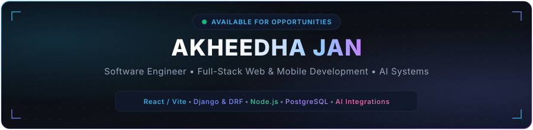

  <!-- Minimalist Tech Header Banner -->
  

    

  <!-- Animated Role Identifier -->
  

   

  <!-- Unified Contact & Social Bar -->
  

    
    &nbsp;
    
    &nbsp;
    
    &nbsp;
    
    &nbsp;
    
  

## Executive Summary

Software Engineer with a strong foundation in **full-stack web architecture**, **cross-platform mobile development**, and **AI integrations**. Experienced in building resilient RESTful backends with **Django** and **Node.js**, dynamic reactive frontends with **React** and **TypeScript**, and deploying containerized applications across cloud platforms. Focused on writing clean, scalable code that turns complex domain problems into seamless digital experiences.

---

## Core Specializations

<table>
  <tr>
    <td width="50%" valign="top">
      <h3>Frontend &amp; Mobile Systems</h3>
      

        
        
        
        
      

      <ul>
        <li>Responsive, component-driven Single Page Applications (SPAs) with <strong>React</strong> &amp; <strong>Vite</strong>.</li>
        <li>Clean cross-platform mobile experiences with <strong>Flutter</strong> and <strong>React Native</strong>.</li>
        <li>Dynamic financial analytics &amp; metric visualizers built with <strong>Recharts</strong>.</li>
      </ul>
    </td>
    <td width="50%" valign="top">
      <h3>Backend &amp; API Architecture</h3>
      

        
        
        
        
      

      <ul>
        <li>Scalable RESTful API engineering using <strong>Django REST Framework</strong> and <strong>Express.js</strong>.</li>
        <li>Stateless authentication, session handling, and RBAC via <strong>JWT</strong>.</li>
        <li>Optimized schema design, query indexing, and relational data modeling with <strong>PostgreSQL</strong>.</li>
      </ul>
    </td>
  </tr>
  <tr>
    <td width="50%" valign="top">
      <h3>AI Integrations &amp; Intelligent Workflows</h3>
      

        
        
        
      

      <ul>
        <li>Automated expense categorization, invoice processing, and predictive financial forecasting.</li>
        <li>Intelligent ATS document parsing, skill-gap extraction, and candidate scoring pipelines.</li>
        <li>Measurable productivity gains, reducing manual processing overhead by <strong>80–85%</strong>.</li>
      </ul>
    </td>
    <td width="50%" valign="top">
      <h3>Cloud, DevOps &amp; Reliability</h3>
      

        
        
        
        
      

      <ul>
        <li>Multi-container orchestration for full-stack environments with <strong>Docker</strong>.</li>
        <li>Automated CI/CD workflows for testing, linting, and zero-downtime deployment pipelines.</li>
        <li>Cloud hosting and asset management across <strong>AWS (EC2, S3), Vercel, and Render</strong>.</li>
      </ul>
    </td>
  </tr>
</table>

---

## Featured Flagship Projects

<table>
  <!-- Project 1 -->
  <tr>
    <td width="50%" valign="top">
      <h3>🏗️ BuildMetrics</h3>
      
<em>AI-Powered Construction Analytics &amp; Expense Intelligence Platform</em>

      

        
        
        
        
      

      <ul>
        <li>Integrated <strong>Google Gemini API</strong> for automated expense classification, material invoice extraction, and cost estimations.</li>
        <li>Engineered end-to-end multi-project tracking system handling live expense records and dynamic budgeting.</li>
        <li>Accelerated cost reconciliation workflows with an <strong>85% reduction in manual data entry time</strong>.</li>
        <li>Real-time financial analytics dashboards visualised with <strong>Recharts</strong>.</li>
      </ul>
      

        
        &nbsp;
        
      

    </td>
    <!-- Project 2 -->
    <td width="50%" valign="top">
      <h3>📄 ResumeForge</h3>
      
<em>Intelligent ATS Candidate Analytics &amp; Evaluation Pipeline</em>

      

        
        
        
        
      

      <ul>
        <li>Automated ATS compatibility scoring, contextual skill-gap analysis, and actionable resume optimization suggestions.</li>
        <li>Built an asynchronous document extraction pipeline using <strong>OpenRouter LLM APIs</strong> and PDF parsing.</li>
        <li>Delivered <strong>~80% reduction in manual resume review turnaround</strong> for recruitment teams.</li>
        <li>Clean, high-response user interface providing instant scoring breakdown and feedback metrics.</li>
      </ul>
      

        
        &nbsp;
        
      

    </td>
  </tr>
  <!-- Project 3 -->
  <tr>
    <td colspan="2" valign="top">
      <h3>🎬 LumixPlay</h3>
      
<em>Enterprise Media Streaming &amp; Content Discovery Platform</em>

      

        
        
        
        
        
        
      

      <ul>
        <li>Engineered a full-featured media catalog with category filtering, user watchlists, and dynamic video playback.</li>
        <li>Developed high-concurrency Django REST backend supporting curated catalog feeds and role-based administrative dashboards.</li>
        <li>Architected stateless JWT token authentication ensuring secure multi-device user sessions.</li>
        <li>Decoupled deployment architecture with frontend served via <strong>Vercel</strong> and backend hosted on <strong>Railway</strong>.</li>
      </ul>
      

        
        &nbsp;
        
      

    </td>
  </tr>
</table>

---

## Technical Arsenal

| Category | Technologies &amp; Tools |
| :--- | :--- |
| **Languages** | `Python` `TypeScript` `JavaScript` `SQL` `HTML5` `CSS3` |
| **Frontend Frameworks** | `React` `Vite` `Tailwind CSS` `Bootstrap` `Recharts` `HTML5/CSS3` |
| **Backend &amp; APIs** | `Django` `Django REST Framework` `Node.js` `Express.js` `RESTful APIs` `JWT` |
| **Databases &amp; Storage** | `PostgreSQL` `MySQL` `MongoDB` `SQLite` |
| **Cloud &amp; DevOps** | `Docker` `AWS (EC2, S3)` `GitHub Actions CI/CD` `Linux` `Vercel` `Render` `Railway` |
| **Mobile &amp; AI Stack** | `Flutter` `React Native` `Google Gemini API` `OpenRouter` `Prompt Engineering` |
| **Engineering Tools** | `Git` `Postman` `VS Code` `Linux CLI` |

---

## Engineering Activity & Metrics

  <table border="0">
    <tr>
      <td align="center" valign="middle">
        
      </td>
      <td align="center" valign="middle">
        
      </td>
    </tr>
    <tr>
      <td colspan="2" align="center" valign="middle">
        
      </td>
    </tr>
  </table>

---

## Let's Connect &amp; Collaborate

  I am actively seeking software engineering opportunities and open to discussing full-stack development, AI products, and innovative web &amp; mobile solutions.

  
  &nbsp;&nbsp;
  
  &nbsp;&nbsp;
  

  

